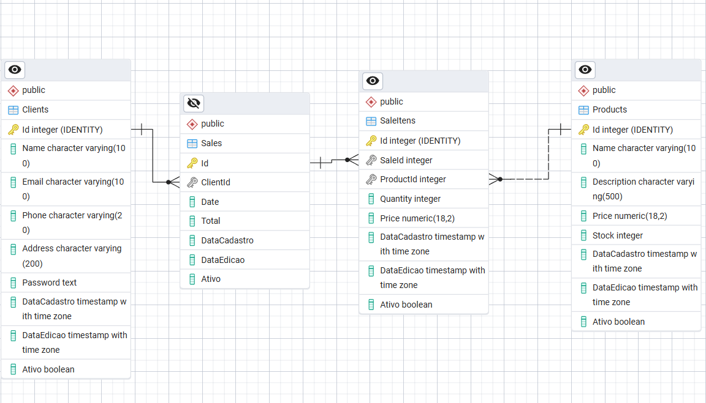

# Client Management API

## Arquitetura Clean

Este projeto segue a arquitetura **Clean Architecture**, que separa as responsabilidades em camadas bem definidas:

- **Domain**: Contém as entidades de negócio e interfaces (regras de negócio puras, sem dependências externas).
- **Application**: Implementa casos de uso e lógica de aplicação, orquestrando as entidades do domínio.
- **Infrastructure**: Responsável por detalhes de implementação como acesso a dados (EF Core), serviços externos, etc.
- **WebApi**: Camada de apresentação, expõe endpoints HTTP e injeta dependências das camadas internas.

Essa separação facilita testes, manutenção e evolução do sistema, além de isolar dependências externas.

---

## Banco de Dados e Migrações

Nesse Projeto Optei por usar o **PostgreSQL** como banco de dados relacional, por ser um banco de baixo custo e Robusto oferece o que o projeto precisa em um MVP e 
tambem o que ele precisa no futuro, além disso pode ser utilizado tanto no onprimece quanto em todos os clouds com custo relativo

O projeto utiliza **Entity Framework Core** para gerenciamento do banco de dados. As migrações são criadas e aplicadas com os comandos:

- O projeto `Infrastructure` contém o contexto e as migrações.
- O projeto `WebApi` é usado como startup para configuração de dependências.

> **Nota:** Futuramente, será adicionada uma imagem ilustrando o desenho das classes e a estrutura do banco de dados, facilitando a visualização das entidades e seus relacionamentos.

### Exemplo de execução de migrações passo a passo
### Exemplo de execução de migrações passo a passo

1. **Criar uma nova migration**  
   No terminal, navegue até a raiz da solução e execute

  `dotnet ef migrations add NomeDaMigration --project Infrastructure --startup-project WebApi`
   - `--project Infrastructure`: indica onde está o DbContext e onde as migrações serão salvas.
   - `--startup-project WebApi`: indica o projeto de inicialização para carregar as configurações.`
1. **Criar uma nova migration**  
   No terminal, navegue até a raiz da solução e execute:
 
  `dotnet ef database update --project Infrastructure --startup-project WebApi` 
   - `--project Infrastructure`: indica onde está o DbContext e onde as migrações serão salvas.
   - `--startup-project WebApi`: indica o projeto de inicialização para carregar as configurações.

2. **Aplicar as migrações ao banco de dados**3. **Verificar o status das migrações**4. **Remover a última migration (caso necessário)**---

## Segurança de Senhas

Para garantir o armazenamento seguro de senhas, **NÃO** são utilizados algoritmos rápidos como MD5, SHA1 ou SHA256 puro, pois são vulneráveis a ataques de força bruta.

Neste projeto, a proteção das senhas é realizada utilizando o algoritmo de derivação de chave PBKDF2, implementado no .NET por meio da classe `Rfc2898DeriveBytes`. Esse método aplica um salt exclusivo e múltiplas iterações para derivar o hash da senha, tornando o processo de quebra significativamente mais difícil para atacantes.

Alternativamente, também seria possível utilizar algoritmos modernos como Argon2 ou bcrypt, disponíveis via bibliotecas externas.

O uso do PBKDF2 com salt e iterações elevadas proporciona uma camada robusta de segurança, alinhada com as melhores práticas de proteção de credenciais.

## Autenticação JWT

O projeto utiliza **JWT (JSON Web Token)** para autenticação, com as seguintes características:

- **Tipo**: Simétrico (mesma chave secreta para assinar e validar tokens)
- **Algoritmo de assinatura**: HMAC SHA-256 (`SecurityAlgorithms.HmacSha256`)
- **Fluxo**:
  - Recebe `userId`, `email` e `roles`
  - Cria claims padrão (`sub`, `email`, `jti`, `iat`) e claims adicionais
  - Gera token JWT assinado com a chave secreta
  - Valida token conferindo assinatura, emissor (`issuer`), audiência (`audience`) e expiração (`exp`)
  - Permite extração de claims conforme necessário

**Importante:** Não utiliza par de chaves pública/privada (não é assimétrico como RS256).

---

## Resumo

- Arquitetura Clean para separação de responsabilidades
- Migrações e atualização de banco via EF Core
- Senhas protegidas com hashing seguro e salt
- Autenticação JWT simétrica com HMAC SHA-256
